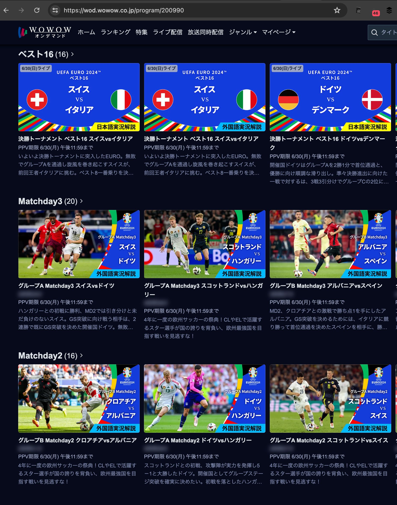
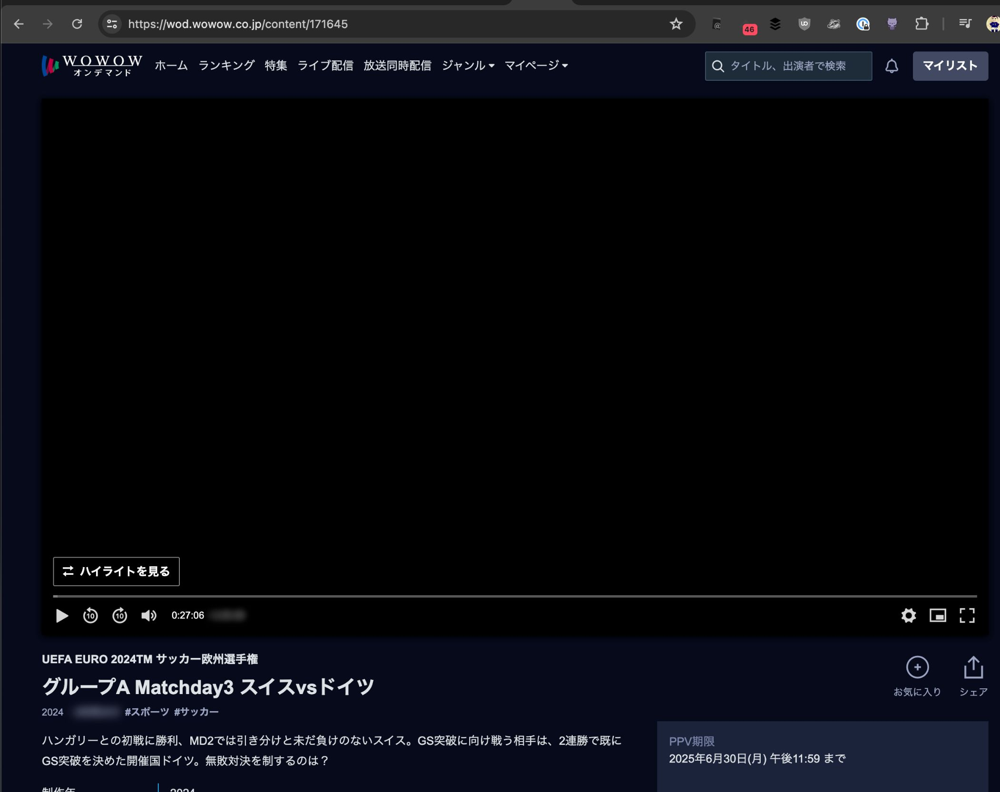
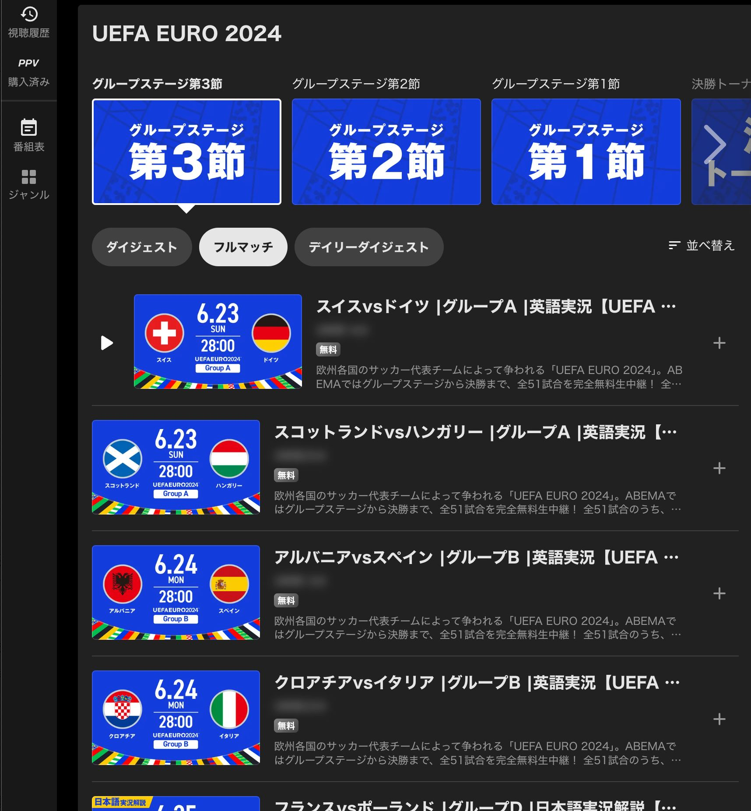
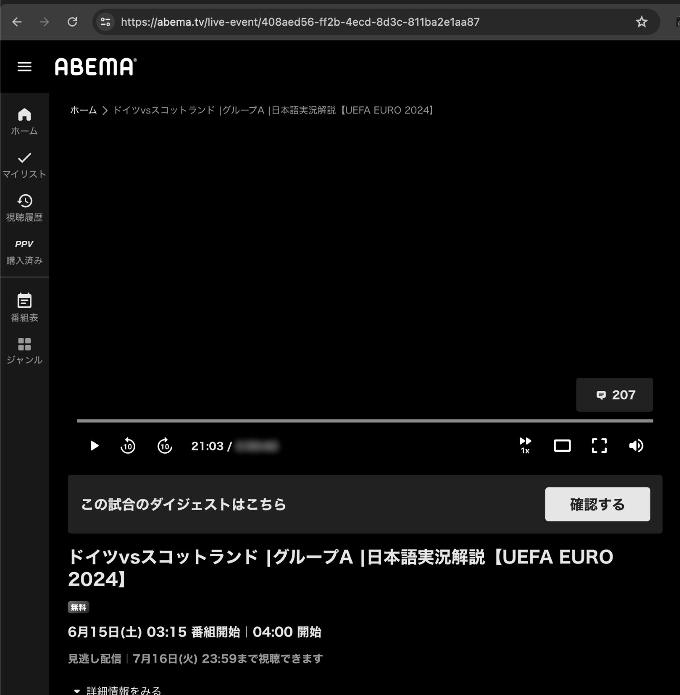

# UserScript: 動画の尺を非表示
## GreasyFork
インストールはこちらから

- [WOWOW オンデマンド](https://greasyfork.org/ja/scripts/499124-wowow-%E3%82%AA%E3%83%B3%E3%83%87%E3%83%9E%E3%83%B3%E3%83%89-%E5%8B%95%E7%94%BB%E3%81%AE%E5%B0%BA%E3%82%92%E9%9D%9E%E8%A1%A8%E7%A4%BA)
- [ABEMA](https://greasyfork.org/ja/scripts/499123-abema-%E5%8B%95%E7%94%BB%E3%81%AE%E5%B0%BA%E3%82%92%E9%9D%9E%E8%A1%A8%E7%A4%BA)

## 概要
動画の長さの表示をぼかしたり、プログレスバーの現在位置を非表示にします。

サッカーなどを追っかけ再生する際、動画の長さで延長戦の有無などが分かってしまうのを回避するために作りました。  
(UEFA EURO 2024 に合わせて作成)

## 動作確認環境
- Google Chrome
  - UserScriptのインストール先: [VioletMonkey](https://violentmonkey.github.io/)

## screenshot
### WOWOW オンデマンド

### ABEMA

